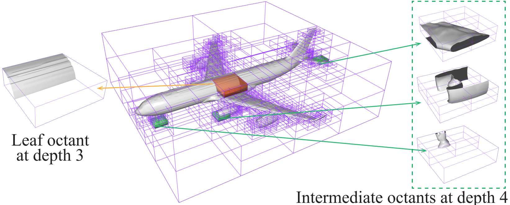

# OctField(Jittor): Hierarchical Implicit Functions for 3D Modeling

## Introduction

This repository is code release for OctField: Hierarchical Implicit Functions for 3D Modeling (arXiv pdf [here](https://arxiv.org/pdf/2111.01067)).

OctField utilizes an octree structure to achieve a hierarchical implicit representation, where part geometry enclosed by an octant is reperesented by a local implicit function.
In this repository, we provide OctField model implementation (with Jittor) as well as data preparation, training and testing scripts on ShapeNet.

## Installation

The code is tested with Ubuntu 18.04, Python 3.7, Jittor 1.3.1.22, CUDA 10.1 and cuDNN v7.5.

Install the following Python dependencies (with `pip install`):
    h5py
    trimesh
    scipy
    scikit-learn
    scikit-image
    pybind11
    tensorboardX

For the jittor installation, please refer to [this link](https://cg.cs.tsinghua.edu.cn/jittor/download).

## Data preprocessing

    1. Compile imp_sampling according to the steps in the imp_sampling/ReadMe.txt and copy the .so file into preproces/
    2. Using normal_tool.py, sample_tool.py, and voxelize_tool.py to compute the voxels and sampled points.
    3. Using pkg_part.py to get the input .h5 file

## Training

    Run train.sh to train the model.

## Testing

    Run eval_recon.py to achieve the reconstruction result.

## Citation

If you find our work useful in your research, please consider citing:

    @inproceedings{tang2021octfield,
        author = {Jia-Heng Tang and Weikai Chen and Jie Yang and Bo Wang and Songrun Liu and Bo Yang and Lin Gao},
        title = {OctField: Hierarchical Implicit Functions for 3D Modeling},
        booktitle = {The Thirty-Fifth Annual Conference on Neural Information Processing Systems (NeurIPS)},
        year = {2021}
    }